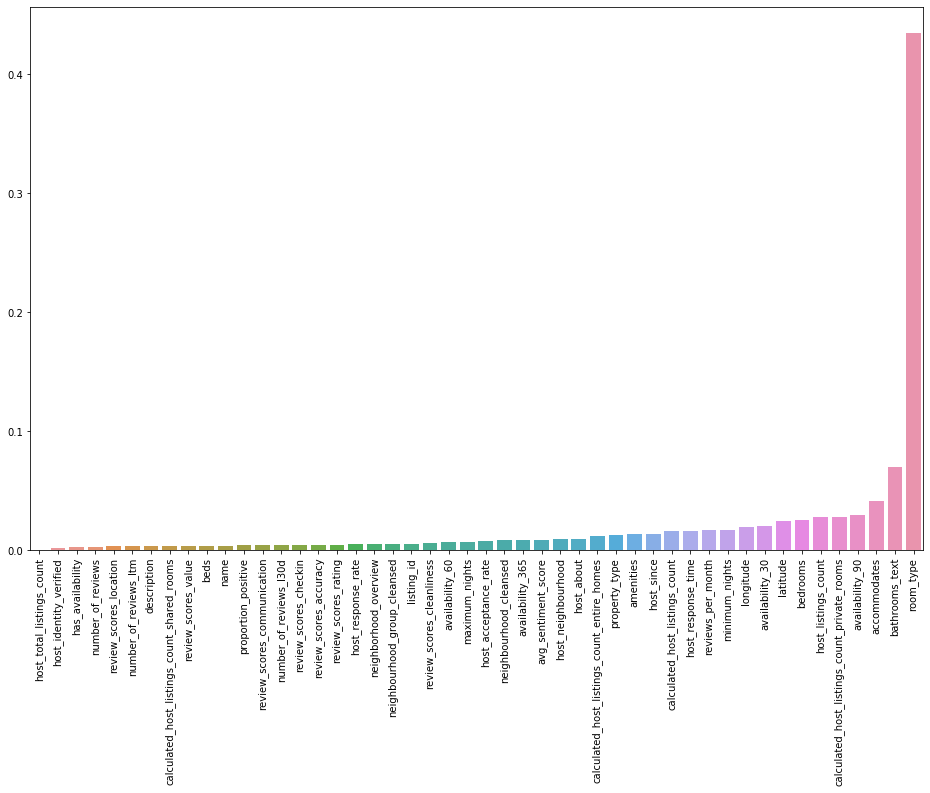
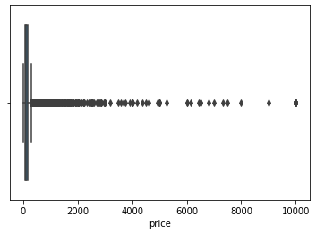
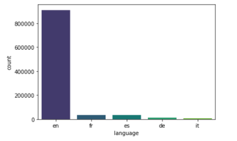
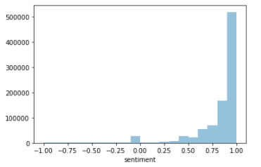
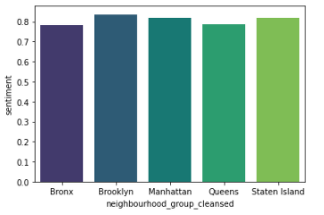
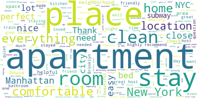
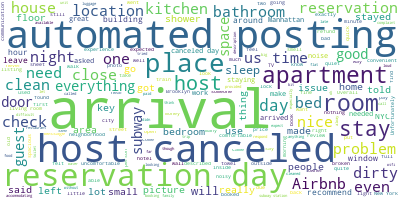

 Project team: Haley Xue, Meghana Jain, Vandana Ramesh, Srikesh Srinivas, Ruiqi Zhu 

## Introduction and Background 
Airbnb is an online marketplace that allows home-owners and renters (‘hosts’) to rent out their properties (‘listings’) to guests. The hosts generally set their own prices for their listings. Although Airbnb and other rental websites provide the hosts with a set of guidelines on how to set the prices for their listings, there aren’t currently any accurate methods that help the hosts price the properties based on a large number of features.  There are quite a few paid third party software available to be able to predict the pricing range, but the hosts also need to put in their expected price of the listing, and the algorithms would change the price based on the day of the week, the season, or other outside factors.  

It is pretty important to get the Airbnb pricing right, especially in big cities around the world where competition is high and small differences in price can alter the popularity of a listing. It is necessary to find the appropriate pricing method and price range on a listing.

Through our project, we plan to learn about the features that would contribute to the price of an Airbnb listing along with the features which would contribute to a higher rating for the listing. We plan to investigate the data of five cities, New York, Boston, Amsterdam, Berlin, and Hong Kong to be able to diversify our results for pricing and ratings. 

## Problem Definition
We plan to explore the pricing and rating predictions using supervised and unsupervised machine learning techniques. Through supervised learning, we would like to predict the price and rating of an Airbnb listing. Through unsupervised learning, we would like to cluster similar listings based on chosen attributes and cluster listings based on reviews. We plan to integrate the supervised and unsupervised results ------- ***

## Data Collection
We obtained our data from Inside Airbnb[1], a website that scrapes Airbnb listings, reviews, and calendar data from multiple cities around the world.  The listings dataset for each city contains listings details (room types, prices, availabilities, host ids and names, average reviews per month, etc.), and neighborhood information. It also includes geographic information which can be used to produce map visualizations. The reviews dataset contains reviews and comments about each Airbnb listing present in the listings dataset.  

## Data Exploration 
### Listings.csv
In order to get a general understanding of the listings data, we generated some exploratory graphs to visualize patterns and groupings.  
#### Number of Listings for each Neighbourhood group 
In New York City, we have the following 5 boroughs: Manhattan, Brooklyn, Queens, Staten Island, and Bronx [2]. As seen in the graph below, most Airbnb listings are found in Manhattan and Brooklyn, which is the most densely populated/landmark heavy borough and the city's most populous borough, respectively. 

    

#### Distribution of Listing Prices
Prices appear to be around 2000-5000 USD for most of the listings, but there are a small number of more expensive listings beyond that threshold. We plan to remove such outlier listings during data cleaning.  

    

#### Price Distributions for Each Neighborhood Group 
Manhattan, Brooklyn, and Queens have a more spread out distribution of prices, as opposed to Staten Island and Bronx. Manhattan appears to have many more high-priced listings than the rest, due to it being a big tourist destination. Staten Island, being the most suburban of the 5, has the fewest and cheapest listings. 

    

#### Price Distributions for Room Type: Each Neighborhood Group
There are 4 room types: Private rooms, Shared rooms, Entire homes/apartments, and Hotel Rooms

    

#### Price Distributions for Accommodation Size: Each Neighborhood Group 
Listing price, on average, goes up as the accommodation size goes up. 

#### Grouping listings based on Price

Taking a first look at our data, we plotted listings based on Airbnb price. Tiers are grouped by percentile:  

Tier 1 (least expensive): price is in the bottom 25%  

Tier 2: price is between the 25th and 50th percentiles 

Tier 3: price is between the 50th and 75th percentiles 

Tier 4 (most expensive): price is in the top 75% 

Manhattan has the most expensive listings, particularly around the Midtown, Chelsea, FiDi areas. Several areas of Brooklyn also have pricier listings (Dumbo, Williamsburg). This makes sense as the neighborhoods are in popular tourist areas that are close to transportation and landmarks.  

    

### Reviews CSV
Reviews.csv just contained listing IDs, date of the review, and comments. The data was explored further during cleaning. 

## Cleaning and Preprocessing 
Most ML algorithms cannot handle or make sense of categorical variables, so it is important that we convert them to meaningful numerical values. Since our data is a mix of numerical and categorical, we go column by column to do the preprocessing. 

### Listings.csv 
* Feature Selection
We used XGboost Regressor to determine the important features amongst the vast amount of features we had by looking at its correlation with price and obtained the graph below.

    

* Dropped the non-important columns : The above graph shows us the most important columns affecting price and rating. Thus, in order to narrow down our features, we removed other unnecessary columns such as URLs, images, and scraping date, host pictures, etc as it was shown to be not meaningful to determining price and rating. 

* Amenities Column : We converted the list of amenities into the length of the list. In other words, we look at how many amenities the listing provides. 

* Neighborhood Overview Column : [3] Tourist Attractions in NYC - We used this list containing all the tourist attractions in NYC to be able to make sense of the neighborhood overview column.  We converted the neighborhood_overview column text into a count of tourist attractions that were mentioned in the text itself. For example, if the text mentioned ‘Times Square’, the count would be 1. 
* Sentimental analysis on name and description  : Non English Names and Descriptions were dropped and then sentimental analysis was performed on them to give two scores, a polarity and a compound score and added to the dataframe.  This conversion was attempted, but we found it to not have much bearing on the results, so we eventually did not add these as features to the models.  

* Label Encoder for other objects : Label encoder encodes target labels with value between 0 and n_classes –1. All other objects were label encoded, such as neighborhood, room_type, property_type, etc. 

* Removing outliers from the Price column 
Prices were in a string format to begin with, so we had to remove ‘$’ and convert the rest into floats. Regex helped us detect and replace those strings. 
We plotted a box plot for the price range as shown below. 

    

We can see that prices beyond $5500 are pretty staggered. Thus, we dropped rows with prices above 5500 considering them to be outliers.  

* Bathrooms in text to float : The bathrooms column was empty, but bathrooms_text was not. We dropped bathrooms, and cleaned up the text version by removing words like ‘half’, and then converting the numerical string into an float. 

* Dropped other rows with any NaNs: There turned out to be several rows with NaN values for multiple columns. We decided to drop them as these correspond to noise in the data

After cleaning the data, we eventually used about 40 features (out of the initial 78) to be able to predict our results. Some of the features are listed below : 

* Number of people the property accommodates 
* Property and room type 
* Location of the property 
* Minimum and Maximum night stay 
* Availability for the next 30 days, 60 days, 90 days and 365 days.  
* Host acceptance and response rate 
* Number of bedrooms, beds, bathrooms 
* A variety of review parameters 
* The price of the listing  
* The number of reviews per month 

### Reviews.csv
We incorporated sentiment analysis on reviews of the Airbnb listings largely in order to engineer new features to be used in predicting the prices and ratings of listings. We classified reviews as positive or negative using the VADER (Valence Aware Dictionary for Sentiment Reasoning) model from the NLTK package[4]. It is a pretrained model that is specifically attuned to sentiments in social media but has been successful when applied to many other domains (see reference below). The VADER model is sensitive to both polarity (positive/negative) and intensity (strength) of emotion; it returns negative, neutral, positive, and compound (normalization of the three other scores) polarity scores.

First, we cleaned the review data set by taking out reviews that did not have any words (e.g. there were some reviews that were a single period). A preliminary run showed that that reviews with three words or fewer or reviews that were not written in English were frequently misclassified. Therefore, we used the langdetect library to filter out non-English reviews. Interestingly, there were a surprisingly number of French guests given the number of reviews written in French.

    

Looking at the compound polarity scores, most of the reviews were strongly positive. The average polarity score was roughly the same across all boroughs.   

  
  

We then dived a deeper into the subsets of positive and negative reviews to see what guests frequently mentioned in their reviews and what made an Airbnb listing more popular among guests. For the subset of positive reviews, it seems that guests frequently mentioned the convenience of location and the cleanliness of the Airbnb. For the subset of negative reviews, it seems that many of the negative reviews are mostly automated postings from the Airbnb site stating that the host cancelled the reservation. A preview of negative reviews confirms this.  
Positive Review Word Cloud |  Negative Review Word Cloud
:-------------------------:|:-------------------------:
  |  

 

We also created two new features based on the sentiment analysis on the set of reviews. We first split up the reviews into positive, negative, and neutral classifications based on the polarity scores. Then for each listing, we calculated the average polarity score across all reviews as well as the proportion of positive reviews of that particular listing.  

 
## Methods
We used the following methods as part of our modelling process:
* Supervised Learning
 * Random Forest - We used a max depth of 20 in order to get the best results. 
 * GBoost 
 * XGBoost
 * Neural Networks - We used ‘relu’ as the activation function for the first three layers, and then output one linear result for the last layer, as our predicted value is continuous. 
 

    

* Unsupervised Learning 
(to be filled)

## Results 
### Supervised Learning 
A train test split was performed with a test size of 0.2. We used MSE, MAE and RMSE to evaluate our models. Using the features in listings and the sentimental score of comments from reviews, for both price and ratings, happened to give us better results for our models than using just the features in Listings. Thus, all our results below are based on that. 

1. Random Forest 
We obtained the following results for price prediction :

| Evaluation Method      | Value |
| ----------- | ----------- |
| Mean Square Error      | 9026.9001|
| Root Mean Square Error   | 95.01  |
| Mean Absolute Error |     |

  
  

We obtained the following results for rating predictions : 
TO be filled 

2. Neural Networks 
We obtained the following results for price prediction :

| Evaluation Method      | Value |
| ----------- | ----------- |
| Mean Square Error      | 27919.0681|
| Root Mean Square Error   | 167.09|
| Mean Absolute Error |   |

 

  
  

We obtained the following results for rating predictions : 

| Evaluation Method      | Value |
| ----------- | ----------- |
| Mean Square Error      | 28.7296|
| Root Mean Square Error   | 5.36|
| Mean Absolute Error |   |

 

  
  

3. GBoost 
We obtained the following results for price prediction :

| Evaluation Method      | Value |
| ----------- | ----------- |
| Mean Square Error      | 8097.5751|
| Root Mean Square Error   | 89.9865|
| Mean Absolute Error | 42.3039  |

 

  
  

We obtained the following results for rating predictions : 

| Evaluation Method      | Value |
| ----------- | ----------- |
| Mean Square Error      | 15.1719 |
| Root Mean Square Error   |3.8951|
| Mean Absolute Error |   | 2.38214 |

 

  
  

2. XGBoost 
We obtained the following results for price prediction :

| Evaluation Method      | Value |
| ----------- | ----------- |
| Mean Square Error      | 7269.424|
| Root Mean Square Error   | 85.2609|
| Mean Absolute Error |40.2345|

 

  
  

We obtained the following results for rating predictions : 

| Evaluation Method      | Value |
| ----------- | ----------- |
| Mean Square Error      |16.9025|
| Root Mean Square Error   |4.1112|
| Mean Absolute Error |   |  2.4193|

 

  
  

Thus we can see that that XGBoost was the best model for price predictions and GBoost was the best model for rating predictions. 

## References 
[1] Pouya Rezazadeh Kalehbasti, Liubov Nikolenko, and Hoormazd Rezaei. Airbnb Price Prediction Using Machine Learning and Sentiment Analysis. arXiv preprint arXiv:1907.12665, 2019. 

[2] Quattrone, G., Greatorex, A., Quercia, D. et al. Analyzing and predicting the spatial penetration of Airbnb in U.S. cities. EPJ Data Sci. 7, 31 (2018). https://doi.org/10.1140/epjds/s13688-018-0156-6 

[3] Yang Li, Quan Pan, Tao Yang, and Lantian Guo. Reasonable price recommendation on Airbnb using multi-scale clustering. In 2016 35th Chinese Control Conference (CCC), pages 7038–7041. IEEE, 2016. 

[4] Zhang, Shunyuan and Lee, Dokyun and Singh, Param Vir and Srinivasan, Kannan, How Much Is an Image Worth? Airbnb Property Demand Estimation Leveraging Large Scale Image Analytics (May 25, 2017). 

## Appendix 
1. [Inside Airbnb](http://insideairbnb.com/get-the-data.html)
2. [Boroughs of NYC] (https://en.wikipedia.org/wiki/Boroughs_of_New_York_City)
3. [Tourist Attractions in NYC] (https://en.wikipedia.org/wiki/List_of_buildings,_sites,_and_monuments_in_New_York_City)
4. Gilbert, C. H. E., & Hutto, E. (2014, June). Vader: A parsimonious rule-based model for sentiment analysis of social media text. In Eighth International Conference on Weblogs and Social Media (ICWSM-14). Available at (20/04/16) http://comp. social. gatech. edu/papers/icwsm14. vader. hutto. pdf (Vol. 81, p. 82). 

