 
 <h1>What Makes a Good Airbnb Listing?  
Airbnb Property Value and Demand </h1>  

 <h2>Project team: Haley Xue, Meghana Jain, Vandana Ramesh, Srikesh Srinivas, Ruiqi Zhu </h2>

## Introduction and Background 
Airbnb is an online marketplace that allows home-owners and renters (‘hosts’) to rent out their properties (‘listings’) to guests. The hosts generally set their own prices for their listings. Although Airbnb and other rental websites provide the hosts with a set of guidelines on how to set the prices for their listings, there aren’t currently any accurate methods that help the hosts price the properties based on a large number of features.  There are quite a few paid third party software available to be able to predict the pricing range, but the hosts also need to put in their expected price of the listing, and the algorithms would change the price based on the day of the week, the season, or other outside factors.  

It is pretty important to get the Airbnb pricing right, especially in big cities around the world where competition is high and small differences in price can alter the popularity of a listing. It is necessary to find the appropriate pricing method and price range on a listing.

Through our project, we plan to learn about the features that would contribute to the price of an Airbnb listing along with the features which would contribute to a higher rating for the listing. We plan to investigate the data of around four cities such as, New York, Amsterdam, Bristol, and Hong Kong to be able to diversify our results for pricing and ratings. 

## Problem Definition
We plan to explore the pricing and rating predictions using supervised and unsupervised machine learning techniques. Through supervised learning, we would like to predict the price and rating of an Airbnb listing. Through unsupervised learning, we would like to cluster similar listings based on chosen attributes and cluster listings based on reviews. We plan to integrate the supervised and unsupervised results by comparing model results on the entire listings data set with the results of applying our models to each cluster separately. The intuition behind this approach is that applying our models on similar listings will reduce noise and lead to more accurate price predictions. 

## Data Collection
We obtained our data from Inside Airbnb[1], a website that scrapes Airbnb listings, reviews, and calendar data from multiple cities around the world.  The listings dataset for each city contains listings details (room types, prices, availabilities, host ids and names, average reviews per month, etc.), and neighborhood information. It also includes geographic information which can be used to produce map visualizations. The reviews dataset contains reviews and comments about each Airbnb listing present in the listings dataset. 

Dimensions of listings.csv datasets:

    

Dimensions of reviews.csv datasets: 

    

## Data Exploration 
We performed data exploration on New York City data and it is as shown below

### Listings.csv
In order to get a general understanding of the listings data, we generated some exploratory graphs to visualize patterns and groupings.  
#### Number of Listings for each Neighbourhood group 
In New York City, we have the following 5 boroughs: Manhattan, Brooklyn, Queens, Staten Island, and Bronx [2]. As seen in the graph below, most Airbnb listings are found in Manhattan and Brooklyn, which is the most densely populated/landmark heavy borough and the city's most populous borough, respectively. 

    

#### Distribution of Listing Prices
Prices appear to be around 2000-5000 USD for most of the listings, but there are a small number of more expensive listings beyond that threshold. We plan to remove such outlier listings during data cleaning.  

    

#### Price Distributions for Each Neighborhood Group 
Manhattan, Brooklyn, and Queens have a more spread out distribution of prices, as opposed to Staten Island and Bronx. Manhattan appears to have many more high-priced listings than the rest, due to it being a big tourist destination. Staten Island, being the most suburban of the 5, has the fewest and cheapest listings. 

    

#### Price Distributions for Room Type: Each Neighborhood Group

There are 4 room types: Private rooms, Shared rooms, Entire homes/apartments, and Hotel Rooms

    

#### Price Distributions for Accommodation Size: Each Neighborhood Group 
Listing price, on average, goes up as the accommodation size goes up. 

    

#### Grouping listings based on Price

Taking a first look at our data, we plotted listings based on Airbnb price. Tiers are grouped by percentile:  

Tier 1 (least expensive): price is in the bottom 25%  

Tier 2: price is between the 25th and 50th percentiles 

Tier 3: price is between the 50th and 75th percentiles 

Tier 4 (most expensive): price is in the top 75% 

Manhattan has the most expensive listings, particularly around the Midtown, Chelsea, FiDi areas. Several areas of Brooklyn also have pricier listings (Dumbo, Williamsburg). This makes sense as the neighborhoods are in popular tourist areas that are close to transportation and landmarks.  

    

### Reviews CSV
Reviews.csv just contained listing IDs, date of the review, and comments. The data was explored further during cleaning. 

## Cleaning and Preprocessing 
Most ML algorithms cannot handle or make sense of categorical variables, so it is important that we convert them to meaningful numerical values. Since our data is a mix of numerical and categorical, we go column by column to do the preprocessing. 

### Listings.csv 
* Feature Selection

We used XGboost Regressor to determine the important features amongst the vast amount of features we had by looking at its correlation with price and obtained the graph below.

    

* Dropped the non-important columns : 

The above graph shows us the most important columns affecting price and rating. Thus, in order to narrow down our features, we removed other unnecessary columns such as URLs, images, and scraping date, host pictures, etc as it was shown to be not meaningful to determining price and rating. 

* Amenities Column : 

We converted the list of amenities into the length of the list. In other words, we look at how many amenities the listing provides. 

* Neighborhood Overview Column : 

We used Tourist Attractions in NYC [3] containing all the tourist attractions in NYC to be able to make sense of the neighborhood overview column.  We converted the neighborhood_overview column text into a count of tourist attractions that were mentioned in the text itself. For example, if the text mentioned ‘Times Square’, the count would be 1. 
* Sentimental analysis on name and description  :

Non English Names and Descriptions were dropped and then sentimental analysis was performed on them to give two scores, a polarity and a compound score and added to the dataframe.  
* Label Encoder for other objects : 

Label encoder encodes target labels with value between 0 and n_classes –1. All other objects were label encoded, such as neighborhood, room_type, property_type, etc. 

* Removing outliers from the Price column :

Prices were in a string format to begin with, so we had to remove ‘$’ and convert the rest into floats. Regex helped us detect and replace those strings. 
We plotted a box plot for the price range as shown below. 

    

We can see that prices beyond $5500 are pretty staggered. Thus, we dropped rows with prices above 5500 considering them to be outliers.  

* Bathrooms in text to float : 

The bathrooms column was empty, but bathrooms_text was not. We dropped bathrooms, and cleaned up the text version by removing words like ‘half’, and then converting the numerical string into an float. 

* Dropped other rows with any NaNs: 

There turned out to be several rows with NaN values for multiple columns. We decided to drop them as these correspond to noise in the data

After cleaning the data, we eventually used about 40 features (out of the initial 78) to be able to predict our results. Some of the features are listed below : 

* Number of people the property accommodates 
* Property and room type 
* Location of the property 
* Minimum and Maximum night stay 
* Availability for the next 30 days, 60 days, 90 days and 365 days.  
* Host acceptance and response rate 
* Number of bedrooms, beds, bathrooms 
* A variety of review parameters 
* The price of the listing  
* The number of reviews per month 

### Reviews.csv
We incorporated sentiment analysis on reviews of the Airbnb listings largely in order to engineer new features to be used in predicting the prices and ratings of listings. We classified reviews as positive or negative using the VADER (Valence Aware Dictionary for Sentiment Reasoning) model from the NLTK package [4]. It is a pretrained model that is specifically attuned to sentiments in social media but has been successful when applied to many other domains (see reference below). The VADER model is sensitive to both polarity (positive/negative) and intensity (strength) of emotion; it returns negative, neutral, positive, and compound (normalization of the three other scores) polarity scores.

First, we cleaned the review data set by taking out reviews that did not have any words (e.g. there were some reviews that were a single period). A preliminary run showed that that reviews with three words or fewer or reviews that were not written in English were frequently misclassified. Therefore, we used the langdetect library to filter out non-English reviews. Looking at the NYC sentiment analysis, interestingly, there were a surprisingly number of French guests given the number of reviews written in French.

    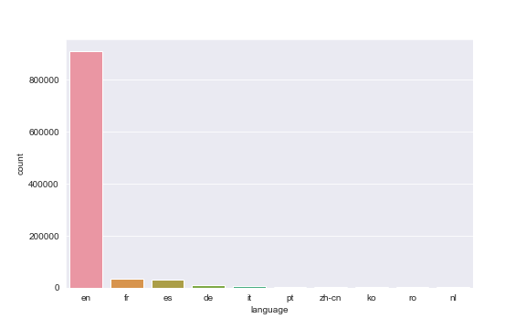

Looking at the compound polarity scores, most of the reviews were strongly positive. The average polarity score was roughly the same across all boroughs.   

  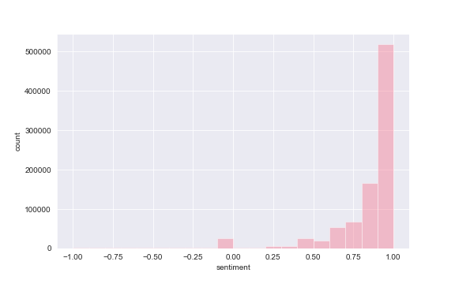
 

 

  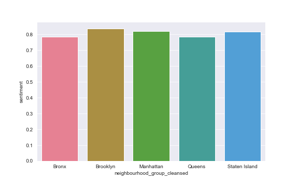

For the other three cities, the polarity distributions of the reviews written in English looked very similar to those of New York with most reviews being very positive. However, while the Amsterdam and Bristol datasets had most reviews written in English, almost half of the reviews in the Hong Kong dataset were written in Chinese or Korean. This distribution of languages in the Hong Kong reviews likely introduced increased error to our Hong Kong analysis and may have contributed to the weak model perfomances. The distribution graph can be found below: 

  

We then dived a deeper into the subsets of positive and negative reviews to see what guests frequently mentioned in their reviews and what made an Airbnb listing more popular among guests. Similar words appeared accross all four cities. For the subset of positive reviews, it seems that guests frequently mentioned the convenience of location and the cleanliness of the Airbnb. For the subset of negative reviews, it seems that many of the negative reviews are mostly automated postings from the Airbnb site stating that the host cancelled the reservation. A preview of negative reviews confirms this.   

  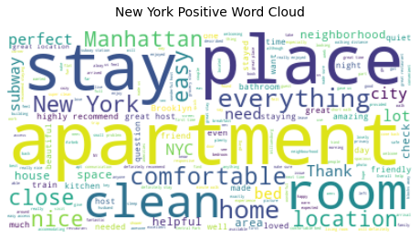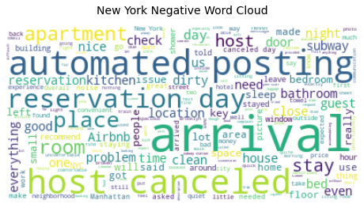
 

 
 

  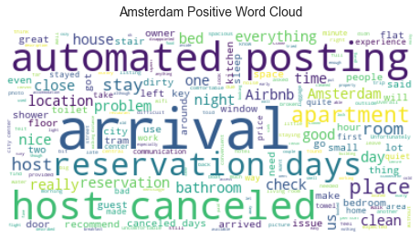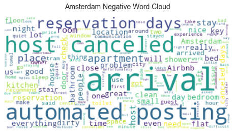
 

 
 

  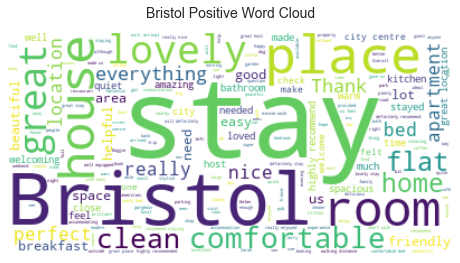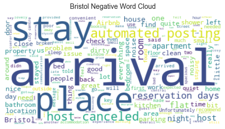
 

 
 

  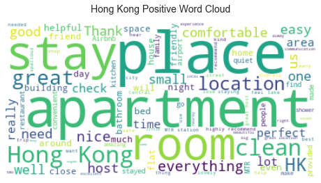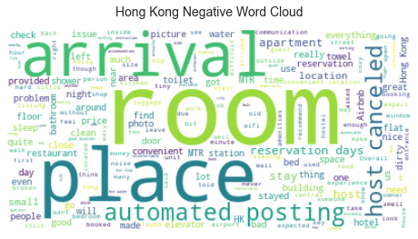
 

 
 
 
We also created two new features based on the sentiment analysis on the set of reviews. We first split up the reviews into positive, negative, and neutral classifications based on the polarity scores. Then for each listing, we calculated the average polarity score across all reviews as well as the proportion of positive reviews of that particular listing.

For unsupervised learned, data from both csv files were needed. Sentiment analysis data from the NLTK polarity scores over both reviews.csv and the filtered listings.csv was combined and syncretized. Categorical data was removed, since k-means does not handle it correctly. Data was then normalized using the StandardScaler librarym which transforms multivariate data over a mean 0 and variance 1. This is needed anytime features are measured in separate units. This subset of the data columns shows the sentiment analysis incorporated into the clustering. Note that this includes any such analysis performed on reviews.csv and listings.csv files. 

    

## Methods
We used the following methods as part of our modelling process:

* Supervised Learning 
	* Random Forest - With max-depth of 20
	* Gradient Boosting
	* XGBoost
	* Neural Networks - We used ‘Relu’ as the activation function for the first three layers, and then output one linear result for the last layer, as our predicted value is continuous. 
 
 

    

* Unsupervised Learning 
	* PCA
	* K-Means
	* Silhouette Analysis
	* Elbow Method
	* NLP (i.e. Sentiment Analysis)
	
* Combining Supervised and Unsupervised Learning 
  * Combined XGBoost with K-Means - apply XGBoost model on each individual cluster for each city

Our approach is innovative because we applied sentiment analysis on reviews to include predictions for price and rating, and we also applied XGBoost models on each cluster in order to achieve better results. 

## Results 
### Supervised Learning 
A train test split was performed with a test size of 0.2. We used MSE, MAE and RMSE to evaluate our models. Using the features in listings and the sentiment score of comments from reviews, for both price and ratings, happened to give us better results for our models than using just the features in Listings. Thus, all our results below are based on that. 

We first implemented the models on only the New York City dataset and decided to pick the best model from our results in order to apply it on the other cities. 
### New York City
#### Random Forest 

We obtained the following results for price prediction :

| Evaluation Method      | Value |
| ----------- | ----------- |
| Mean Square Error      | 9026.9001|
| Root Mean Square Error   | 95.01  |
| Mean Absolute Error | 43.82    |

  
  

 

  

	

We obtained the following results for rating predictions : 

| Evaluation Method      | Value |
| ----------- | ----------- |
| Mean Square Error      | 30.905|
| Root Mean Square Error   | 5.5592  |
| Mean Absolute Error |2.8132   |

  
  

 

  

#### Neural Networks 

We obtained the following results for price prediction :

| Evaluation Method      | Value |
| ----------- | ----------- |
| Mean Square Error      | 27919.0681|
| Root Mean Square Error   | 167.09|
| Mean Absolute Error |  67.14 |

 

  
  

 

  

We obtained the following results for rating predictions : 

| Evaluation Method      | Value |
| ----------- | ----------- |
| Mean Square Error      | 28.7296|
| Root Mean Square Error   | 5.36|
| Mean Absolute Error | 3.84  |

 

  
  

 

  

#### Gradient Boosting 

We obtained the following results for price prediction :

| Evaluation Method      | Value |
| ----------- | ----------- |
| Mean Square Error      | 8097.5751|
| Root Mean Square Error   | 89.9865|
| Mean Absolute Error | 42.3039  |

 

  
  

 

  

We obtained the following results for rating predictions : 

| Evaluation Method      | Value |
| ----------- | ----------- |
| Mean Square Error      | 15.1719 |
| Root Mean Square Error   |3.8951|
| Mean Absolute Error | 2.38214   |

 

  
  

 

  

#### XGBoost 

We obtained the following results for price prediction :

| Evaluation Method      | Value |
| ----------- | ----------- |
| Mean Square Error      | 7269.424|
| Root Mean Square Error   | 85.2609|
| Mean Absolute Error |40.2345|

 

  
  

 

  

We obtained the following results for rating predictions : 

| Evaluation Method      | Value |
| ----------- | ----------- |
| Mean Square Error      |16.9025|
| Root Mean Square Error   |4.1112|
| Mean Absolute Error |    2.4193|

 

  
  

 

  

Thus we can see that that XGBoost was the best model for price predictions and Gradient Boosting was the best model for rating predictions for New York City. 
We applied the same models to see price and rating predictions for the following cities as well. 

### Amsterdam, Netherlands
####  Gradient Boosting 
We obtained the following results for price predictions:

| Evaluation Method      | Value |
| ----------- | ----------- |
| Mean Square Error      |7357.9843|
| Root Mean Square Error   |85.7786|
| Mean Absolute Error | 44.271|

 

  
  

 

  
	

We obtained the following results for rating predictions:

| Evaluation Method      | Value |
| ----------- | ----------- |
| Mean Square Error      |11.2184|
| Root Mean Square Error   |3.3484|
| Mean Absolute Error | 2.1047|

 

  
  

 

  

#### XGBoost 
We obtained the following results for price predictions:

| Evaluation Method      | Value |
| ----------- | ----------- |
| Mean Square Error      |7357.9843|
| Root Mean Square Error   |85.7786|
| Mean Absolute Error | 44.271|

 

  
  

 

  

We obtained the following results for rating predictions:

| Evaluation Method      | Value |
| ----------- | ----------- |
| Mean Square Error      |5755.6464|
| Root Mean Square Error   |75.8685|
| Mean Absolute Error | 42.8212|

 

  
  

 

  

For Amsterdam, XGBoost performed better for price predictions compared to Gradient Boost for Amsterdam whereas both models performed very similarly for rating predictions. 

### Hong Kong, China

####  Gradient Boosting 
We obtained the following results for price predictions:

| Evaluation Method      | Value |
| ----------- | ----------- |
| Mean Square Error      |144343.8335|
| Root Mean Square Error   |379.926|
| Mean Absolute Error | 195.654|

 

  
  

 

  

We obtained the following results for rating predictions:

| Evaluation Method      | Value |
| ----------- | ----------- |
| Mean Square Error      |19.0294|
| Root Mean Square Error   |4.3622|
| Mean Absolute Error | 3.0009|

 

  
  

 

  

#### XGBoost 
We obtained the following results for price predictions:

| Evaluation Method      | Value |
| ----------- | ----------- |
| Mean Square Error      |150159.722|
| Root Mean Square Error   |387.5044|
| Mean Absolute Error | 189.1131|

 

  
  

 

  

We obtained the following results for rating predictions:

| Evaluation Method      | Value |
| ----------- | ----------- |
| Mean Square Error      |21.2487|
| Root Mean Square Error   |4.6096|
| Mean Absolute Error | 3.0623|

 

  
  

 

  

Hong Kong did not give us satisfactory results for price predictions for these models. We believe this could be because our dataset having a small number of rows after cleaning, because we dropped quite a lot of rows having non-english reviews. 
Gradient boosting performed better than XGBoost for rating predictions.

### Bristol, United Kingdom

####  Gradient Boosting 
We obtained the following results for price predictions:

| Evaluation Method      | Value |
| ----------- | ----------- |
| Mean Square Error      |2213.365|
| Root Mean Square Error   |47.0464|
| Mean Absolute Error | 20.96613|

 

  
  

 

  

We obtained the following results for rating predictions:

| Evaluation Method      | Value |
| ----------- | ----------- |
| Mean Square Error      |10.8849|
| Root Mean Square Error   |3.2992|
| Mean Absolute Error | 2.097|

 

  
  

 

  

#### XGBoost 
We obtained the following results for price predictions:

| Evaluation Method      | Value |
| ----------- | ----------- |
| Mean Square Error      |791.4988|
| Root Mean Square Error   |28.1335|
| Mean Absolute Error | 17.0718|

 

  
  

 

  

We obtained the following results for rating predictions:

| Evaluation Method      | Value |
| ----------- | ----------- |
| Mean Square Error      |2.2319|
| Root Mean Square Error   |3.4902|
| Mean Absolute Error | 2.1816| 

 

  
  

 

  

Bristol dataset gave us the best results for price predictions. XGBoost performed better for price predictions and Gradient Boosting performed better for rating predictions, standing similar with results from NYC dataset. 

### Unsupervised Learning
#### Clustering Analysis
The bulk of mathematical analysis was performed using sklearn library imports.

PCA (Principal Component Analysis) was run on the reduced features to abstract the most variance into fewer PCA components. We see in the histogram below, the amount of explained variance captured by each of the two components. 

sklearn.decomposition.PCA APIs performed the dimensionality reduction; internally, data is centered and SVD is applied.

    

Elbow Method and Silhouette Analysis were utilized to determine the optimal number of clusters. It is shown from the below views that 3 clusters would provide the such optimality. Observe, for instance, the "elbow" at k=3 with an SSE slightly under 39000. We can see from Silhouette Analysis one cluster tends to dominate, suggesting some similarity among listings that cannot be reduced. 

sklearn.cluster.KMeans APIs performed the work of the underlying algorithm and utilize a slightly more advanced algorithm, k-means++.

    
	
	
	
	

The final K-Means data below is plotted in a more traditional format against the two PCA components.

    

It is also presented on the map of NYC to present data in a more visually relevant format. Map displays locations of listings by cluster. GeoPandas package was utilized for this map. We see similar listings spreead relatively evenly across NYC. 

Note, howevever, that one can discern by portions of each region. For example, most of Manhattan's northern strip falls under Cluster 2, as does much of Central Brooklyn and Queens. 

    

Finally, the exploratory analysis included running the PCA/K-Means clustering sequence on reduced features from the original input data, discarding those that had little effect on the variance (i.e. more similar, less relevant).

The features utilized in this reduced analysis were: 
PCA Analysis was run on the resultant features to abstract the most variance into fewer PCA components. 
The histogram that plots the explained variance captured by each of PCA components. It is shown that the majority of the variance is captured by the first two components.

    

Elbow Method and Silhouette Analysis shows optimal number of clusters is again 3. Observe that the silhouette coefficient peaks at around 0.582 and SSE elbow is observed at SSE = 40000 for k=3.
Note that dominance of one single cluster, suggesting irreducible similarity. 

    
	
	
	

The results of this exploratory analyis are shown, first plotted in a more traditional format against the two PCA components.

    

Thus, We see similar listings spreead relatively evenly across NYC. 

Note, howevever, that one can discern by portions of each region. For example, quite a bit of East Manhattan falls under Cluster 2, as does much of Northern Queens. 

    

Subsequent analysis involved K-Means and GMM modelling using the supervised learning datasets (i.e. incorporated more calculated features). This analysis was performed four the same four cities as supervised learning. Data was normalizes to a Gaussian distribution using StandardScaler and GMM analysis was performed using sklearn.mixture.GaussianMixture import.

GMM analysis with PCA components too closely mirrored the original clusterings. So in order to obtain more valid analysis GMM simply ran between Price and another feature that provided meaningful representation. Price was compared against three features: 365 Day Room Availabbility, Number of Reviews per Month, and Average Sentiment Score (from previously discussed sentiment analysis). The rough equality of the components attests to the validity of the clusterings. The scatterplots and corresponding mappings are shown for each city below. 

#### New York City, New York
##### K-Means Clustering (with Larger Dataset)

	
	
    

Further K-Means clustering was perfomed using the same listings dataset from supervised learning. PCA and Elbow Method analysis was performed, identical to the original tests. The histogram shows the z-space component explained variance and the line chart clearly shows an "elbow" at SSE ~ 80000 with k=3. Silhouette Analysis revealed a coefficient of 0.63, but is not shown here for the sake of brevity. Regression (e.g. XGBoost) was run on these new clusters in order to generate different findings. The equality of each cluster also attests to the accuracy of the clusterings. There were roughly 30000 NYC listings. Sentiment analysis scores were utilized in the 2 PCA components.

##### GMM Analysis

    
    
    

    
    
    

We can observe from the Price vs. 365-Availability visuals that more expensive rooms have longer annual availability. As evidenced by the first two cluster scheaper and more short-term rooms are congregated in the north side of NYC; the final cluster is dominant in the southern half of the city and represent the popularity of more expensive and long-term rooms.

We can see from the Price vs. Reviews per Month visuals that rooms with more reviews tend to be congregated in the northern half of the city, possibly because of higher tourism or population, and pricier, less reviewed rooms are in the south side. Notice the lesser frequency of these rooms, as they are luxury condiments.

We also note from the two sentiment score visuals that even very cheap rooms sometimes get good average ratings.

#### Amsterdam, Netherlands
##### K-Means Clustering (with Larger Dataset)

	
	
    

Further K-Means clustering was perfomed using the same listings dataset from supervised learning. PCA and Elbow Method analysis was performed, identical to the original tests. The histogram shows the z-space component explained variance and the line chart clearly shows an "elbow" at SSE ~ 50000 with k=3. Silhouette Analysis revealed a coefficient of 0.61, but is not shown here for the sake of brevity. Regression (e.g. XGBoost) was run on these new clusters in order to generate different findings. The equality of each cluster also attests to the accuracy of the clusterings. There were roughly 15000 Amsterdam listings. Sentiment analysis scores were utilized in the 2 PCA components.

##### GMM Analysis

    
    
    

    
    
    

We can observe fromn this analysis that clusters are generally equal for all three scenarios and rooms tend to be concentrated in the city center. Reviews per month visuals are generally dominated by one component, indicating their independence of price. Rooms of all prices had highest sentiment ratings, as evidenced by Component 2 (red cluster) in the Price vs. Avg Sentiment Score City Map.

#### Hong Kong, China
##### K-Means Clustering (with Larger Dataset)

	
	
    

Further K-Means clustering was perfomed using the same listings dataset from supervised learning. PCA and Elbow Method analysis was performed, identical to the original tests. The histogram shows the z-space component explained variance and the line chart clearly shows an "elbow" at SSE ~ 50000 with k=3. Silhouette Analysis revealed a coefficient of 0.64, but is not shown here for the sake of brevity. Regression (e.g. XGBoost) was run on these new clusters in order to generate different findings. The equality of each cluster also attests to the accuracy of the clusterings. There were roughly 3000 listings for Hong Kong. Sentiment analysis scores were utilized in the 2 PCA components.

##### GMM Analysis

    
    
    

    
    
    

We can observe fromn this analysis that clusters are generally equal for all three scenarios and rooms tend to be concentrated in the city center. The interesting thing to note here is that Components 2 and 3 of the seniment visuals cluster rooms with lower prices and higher average sentiment ratings, which is useful for the thrifty purchaser. These clusters are generally distributed fairly equally across the city's constituency's.

#### Bristol, United Kingdom
##### K-Means Clustering (with Larger Dataset)

	
	
    

Further K-Means clustering was perfomed using the same listings dataset from supervised learning. PCA and Elbow Method analysis was performed, identical to the original tests. The histogram shows the z-space component explained variance and the line chart clearly shows an "elbow" at SSE ~ 40000 with k=3. Silhouette Analysis revealed a coefficient of 0.64, but is not shown here for the sake of brevity. Regression (e.g. XGBoost) was run on these new clusters in order to generate different findings. The equality of each cluster also attests to the accuracy of the clusterings. There were roughly 1200 listings for Bristol. Sentiment analysis scores were utilized in the 2 PCA components. These clusters are generally distributed fairly equally across the city's constituency's.

##### GMM Analysis

    
    
    

    
    
    

We again observe typically equal clusterings. The Price vs. Avg Sentiment Score visuals are informative here. Although component 1 dominates component 2 (light blue) only contains listings with high sentiment ratings (and slightly highly prices). This is useful for a buyer who want a high quality room irrespective of price. These clusters are generally distributed fairly equally across the city's constituency's.

### Combining Supervised and Unsupervised Learning
To see if we could improve our model predictions for prices, we tried combining our XGBoost model with our KMeans clustering. We applied the XGBoost to each cluster for each city (i.e. 12 runs). However, the results showed no major improvements to prediction errors (in some cases, errors were actually worse). This is likely due to the fact that as the dataset becomes smaller and more smiliar, some of rows may start to conflict with each other and make predictions more inaccurate. Our predictions for Bristol had a relatively small RMSE, but the price range of Airbnb listings for this city is more narrow than that of the other three cities, and as a percentage of the range of prices, the predictions are only slightly better than those of the other cities. With all cities, we saw that combining our models performed much better on the training data, but worse on the test data (i.e. our combined model has high variance). 

    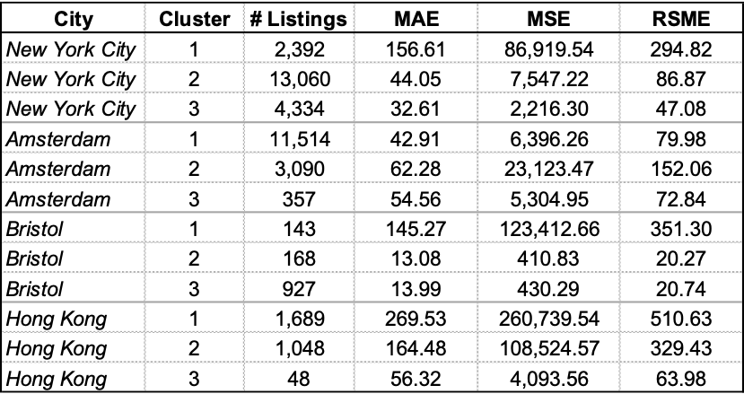

## Discussion and future work

* Cities where the reviews were in English helped us predict price and rating when sentimental analysis was performed on these over cities with reviews in other languages. Thus, language translation followed by NLP on those reviews could be performed in order to obtain better results. 
* It also does seem like datasets with smaller number of rows such as Bristol,England tends to perform too well and hence might be overfitting the supervised models. Future work in this area could include hyperparameter tuning for the Gradient Boosting and XGBoost models. 
* To reduce the prediction error of our model, one could also try splitting the listings into smaller subsets with different tiers of pricing. Different models may perform better on different subsets. In the case of the XGBoost model, this would also reduce the effect of conflicting data points. 

## Conclusion 
* XGBoost and Gradient Boost models did well to predict price and ratings of airbnb listings. 
* GMM and K means ........

## References 

1. [Inside Airbnb](http://insideairbnb.com/get-the-data.html)
2. [Boroughs of NYC] (https://en.wikipedia.org/wiki/Boroughs_of_New_York_City)
3. [Tourist Attractions in NYC] (https://en.wikipedia.org/wiki/List_of_buildings,_sites,_and_monuments_in_New_York_City)
4. Gilbert, C. H. E., & Hutto, E. (2014, June). Vader: A parsimonious rule-based model for sentiment analysis of social media text. In Eighth International Conference on Weblogs and Social Media (ICWSM-14). Available at (20/04/16) http://comp. social. gatech. edu/papers/icwsm14. vader. hutto. pdf (Vol. 81, p. 82). 

